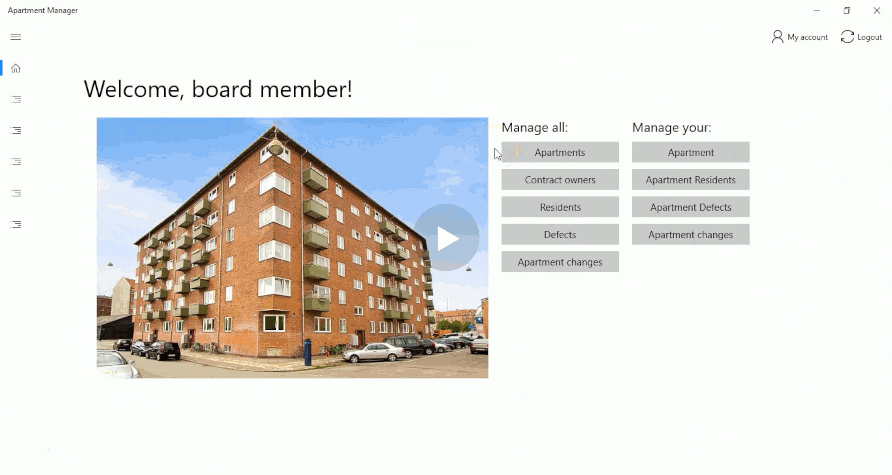

# Apartment Manager

A system for managing apartments, residents, changes, and defects at Østbanehus apartment building in Copenhagen. Mandatory school project on the 2nd semester of the Computer Science course at Erhvervsakademi Sjælland.

## Preview

[Full demo](https://www.youtube.com/watch?v=K9CV8iHgHOc)

## Description

The system was created in collaboration with a Danish IT company, [Beck IT](http://www.beckit.dk/en/for-students/projects/), which provided requirements and was answering our questions about the project.

The project was made in a group of four students and lasted two months. We had to create a working product and describe our work in a report.

During the work we followed phases of Unified Process. In the Inception phase, we performed business analysis (business model canvas, SWOT, Porter's Five Forces). In Elaboration, we focused on the requirements. We created vision, identified features, made use cases, and prototypes. In the Construction phase, we designed the system, created various system design diagrams, and developed the system. The last phase was Transition, in which we put finishing touches.

The system was built in C# programming language and .NET Framework 4.5.2. The application was created using Universal Windows Platform 5.3.3. The REST API was developed with ASP.NET Web API 5.2.3 and Entity Framework 6.1.3. A Microsoft SQL Server was used for database. The web API and database were hosted, as well as continuosly integrated and deployed on Microsoft Azure.

## Features

- Management of apartments in the building
  - Overview of all apartments
  - Filtering and search
  - Adding new apartments
  - Updating information about apartments
  - Adding apartment plans
  - Removing apartments
- Management of apartment owners and other residents
  - Overview of owners and residents
  - Search function
  - Adding new residents
  - Updating information
  - Profile picture upload
  - Promoting to board member
  - Deleting residents
- Management of changes and defects
  - Display of changes and defects
  - Filtering
  - Adding new cases
  - Uploading photos
  - Editing cases
  - Comments
  - Closing cases
- Authentication for two user types: board members and apartments owners
- Built for Windows 10 as a Universal Windows Platform application

## Contents

This repository contains various files that were created throughout the course of the project:

- **ApartmentManager** - Source code of the project
  - **ApartmentManager** - UWP app
  - **ApartmentManagerUnitTestProject** - unit tests for the app
  - **HousingWebApi** - REST API used by the app
- **Diagrams** - diagrams with design of the system and business artifacts
- **Test queries** - Database tests
- **Exam presentation.docx** - Plan of the exam presentation
- **FinalReportDelta.odt** - Final version of the project report
- **Query.sql** - Queries used to create tables in the database

## Authors

- [Donatas Adamonis](https://github.com/DonatasAd)
- [Mikkel Frederiksen](https://github.com/Mifd39)
- [Paulius Klezys](https://github.com/pekopa)
- [Marcin Zelent](https://github.com/marcinzelent)
